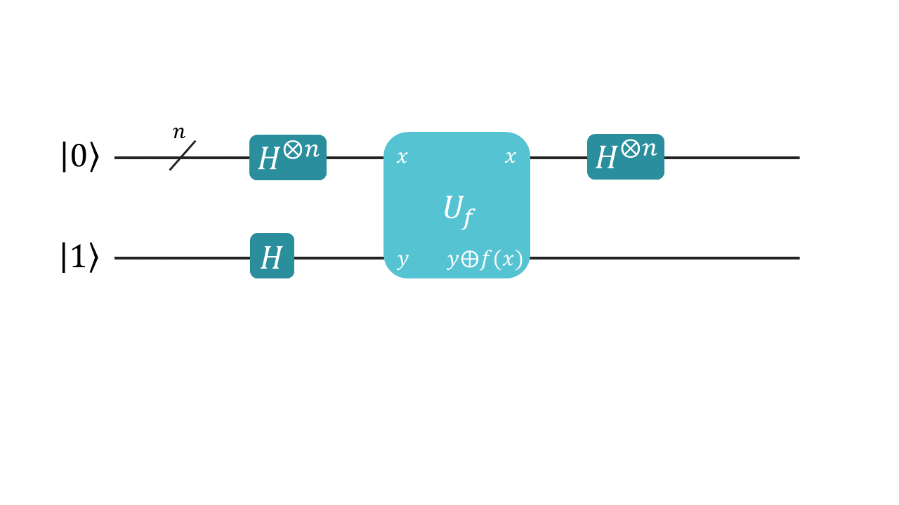

# Deutsch-Jozsa算法

Deutsch-Jozsa算法是说明量子计算相较于经典计算优势的一个算法。

假设有一个函数 $f$，是定义在长度为n的所有比特串上，取值为0或1的函数，它要么恒为常数，要么是平衡的（即一半的结果是1，另一半的结果是0）。现在的任务是判断它是否为常数函数。虽然只要找到两个不同的函数值，就立刻可以得出否定的结果，但若要确定它是常值函数，只能检验它在所有 $2^{n-1}+1$ 个比特串上的值，少一个都不行。因此最坏情况总要做指数多的检验。但是在量子计算机上，给定一个存储f信息的酉变换（被称为 quantum oracle）$U_f$，只需要一步就可以验证结果。

此算法的量子电路如下：



其中初始态 $|x\rangle=|0^{\otimes n}\rangle$，$|y\rangle=|1\rangle$。 $U_f$定义如下：
$$
\begin{align}
U_f:\{0,1\}^n\times\{0,1\}\rightarrow\{0,1\}^n\times\{0,1\}\\
|x\rangle \otimes |y\rangle \rightarrow |x\rangle \otimes|y\oplus f(x)\rangle\\
\end{align}
$$
$U_f$将会作用于已制备好的态：
$$
\frac{1}{\sqrt{2^{n+1}}}\sum_{x=0}^{2^n-1}|x\rangle(|0\rangle-|1\rangle)
$$
随后对前$n$个qubit进行$X$基的测量，得到结果0后状态：
$$
\begin{aligned}
&\bigg ( \frac{1}{\sqrt{2^{n}}}\sum_{x=0}^{2^n-1}\langle x|\otimes I\bigg )\bigg(\frac{1}{\sqrt{2^{n+1}}}\sum_{x=0}^{2^n-1}|x\rangle\big(|f(x)\rangle-|1\oplus f(x)\rangle\big)\bigg)\\
&=\bigg ( \frac{1}{\sqrt{2^{n}}}\sum_{x=0}^{2^n-1}\langle x|\otimes I\bigg )\bigg(\frac{1}{\sqrt{2^{n+1}}}\sum_{x=0}^{2^n-1}(-1)^{f(x)}|x\rangle\big(|0\rangle-|1\rangle\big)\bigg)\\
&=\frac{1}{2^n}\sum_{x=0}^{2^n-1}(-1)^{f(x)}|-\rangle
\end{aligned}
$$
测量结果只能为0或1。若 $f$ 为常值函数则结果为1，否则为0。

若 $f$ 是常值函数，则得到的概率为$|\frac{1}{2^n}\times 2^n|^2=1$，否则为$|\frac{1}{2^n}\times\big( (-1)\times2^{n-1}+1\times2^{n-1}\big)|^2=0$。


下面我们利用量易伏平台来验证两个简单的例子：$f_1=0$，$f_2(x) = x$的第一位。
```python{.line-numbers, highlight=7}
"""
Deutsch-Jozsa Algorithm.
Suppose: f1 = 0, f2 = first bit.
"""

from QCompute import *
n = 10  # total qubit number


def analyze_result(result):
    print("Result", result)
    for key, values in result.items():
        binstring = list(reversed(list(key)))
        oct = 0
        for pos in range(len(binstring)):
            if binstring[pos] == '1':
                oct += 2**pos
        if oct % (2**n) == 0:
            print("Outcome |0>^n|y> appears, so the function is constant.")
            break
        else:
            print("Outcome other than |0>^n|y> appears, so the function is balanced.")


def main():
    """
    main
    """
    env1 = QuantumEnvironment()
    env1.backend(BackendName.LocalBaiduSim2)
    env2 = QuantumEnvironment()
    env2.backend(BackendName.LocalBaiduSim2)

    # Prepare the state:
    q1 = []
    q2 = []
    for i in range(n):
        q1.append(env1.Q[i])
        q2.append(env2.Q[i])
        H(q1[i])
        H(q2[i])
    q1.append(env1.Q[n])
    q2.append(env2.Q[n])
    X(q1[n])
    X(q2[n])
    H(q1[n])
    H(q2[n])

    # Apply U_f:
    # f1 = 0, so do nothing on q1.
    # f2 = first bit, so if the first bit is 0 do nothing, else swap q2[n].
    CX(q2[0], q2[n])

    # Measure:
    for i in range(n):
        H(q1[i])
        H(q2[i])
    MeasureZ(q1, range(n+1))
    MeasureZ(q2, range(n+1))
    taskResult1 = env1.commit(shots=1, fetchMeasure=True)
    taskResult2 = env2.commit(shots=1, fetchMeasure=True)

    # Analyze:
    analyze_result(taskResult1['counts'])
    analyze_result(taskResult2['counts'])


if __name__ == '__main__':
    main()
```

得到的结果如下：（最高位即$y$，可能出现0或1）
```python
Result {'-0000000000': 1}
Outcome |0>^n|y> appears, so the function is constant.
Result {'-0000000001': 1}
Outcome other than |0>^n|y> appears, so the function is balanced.
```
---
## 参考文献
[David Deutsch and Richard Jozsa (1992). "Rapid solutions of problems by quantum computation". Proceedings of the Royal Society of London A. 439 (1907): 553–558.](https://royalsocietypublishing.org/doi/abs/10.1098/rspa.1992.0167)