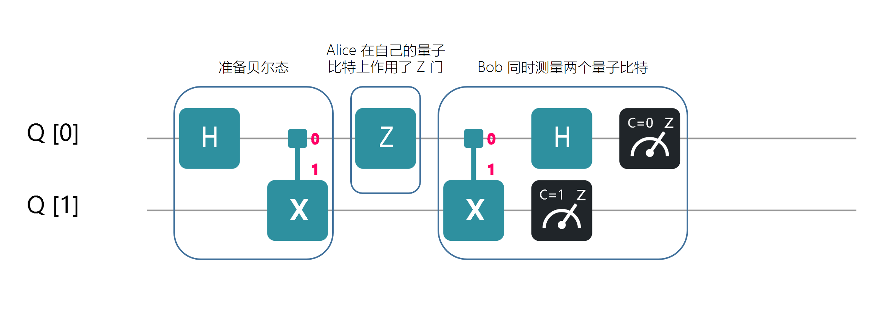

# 量子超密编码

Bennett & Wiesner 于 1992 年发明量子超密编码，其是通过发送一个量子比特来传输两个经典比特信息的一种量子通信协议。简单来说，量子超密编码利用量子纠缠的特性拓展了信道容量。为了说明这一通信方式，我们假设有 Alice 和 Bob 两个用户，并且他们共享一对纠缠的量子比特，且这对量子比特处于最大纠缠态（贝尔态）$|\Phi^+ \rangle = (|0\rangle_A \otimes|0\rangle_B + |1\rangle_A \otimes|1\rangle_B)/\sqrt{2}\,.$


将两个量子比特初始化成量子态 $|0\rangle_A\otimes|0\rangle_B$ 并运行上图中的电路，即可制备出一个贝尔态。然后两个用户各取贝尔态中的一个量子比特，我们假设 Alice 拿到的是上面的量子比特 $q_0$，Bob 拿到的则是下面的 $q_1$。现在假设 Alice 和 Bob 分隔很远，但 Alice 想给 Bob 传输两个经典比特的信息，即$\{00,01,10,11\}$中的某一元素。那么，Alice 首先需要对量子比特 $q_0$ 进行相应的操作，然后将其发送给 Bob。Bob 收到量子比特 $q_0$ 后，对两个量子比特进行测量，便能解码出 Alice 想要传输的经典信息。

如果 Alice 想传输 $00$ 给远处的 Bob, 那么 Alice 只需要把自己提前分到的量子比特 $q_0$ 直接发送给 Bob。当 Bob 收到 Alice 发送的量子比特后，按顺序将两个量子比特排好位置， 施加如下的电路，得到的测量结果就是 $\lvert {00}\rangle$, 也就是 Alice 试图发送的信息：


如果 Alice 想发送 $01$ 怎么办？很简单，她只需要先在自己的 qubit 上作用 $Z$ 门，然后再把自己的 qubit 发送给 Bob。Bob 收到 Alice 的 qubit，同样是将两个 qubit 排好序（Alice 的 qubit 在上）， 然后作用上图的电路，测得的结果恰好就是 $\lvert {01}\rangle$, 完整的过程如下：



如果 Alice 想发送 $10$， 那么她需要先在自己的量子比特上作用 $X$ 门，然后再把自己的量子比特发送给 Bob。如果 Alice 想传输 $11$，那么她需要先在自己的量子比特上作用 $Z$ 还有 $X$ 门，然后再把自己的量子比特发送给 Bob。关于发送 $10$ 和 $11$ 的完整示意图分别如下：


这便是量子超密编码协议，下面我们使用量易伏来实现它：
```python
import sys
sys.path.append('../../..')  # "from QCompute import *" requires this
from QCompute import *

matchSdkVersion('Python 3.3.0')

# Set the shot number for each quest
shots = 1024

# The message that Alice want to send to Bob.
# The user you can modify the massage to '00', '01' or '10' as you like
message = '11'


def main():
    """
    main
    """
    # Create environment
    env = QEnv()
    # Choose backend Baidu Local Quantum Simulator-Sim2
    env.backend(BackendName.LocalBaiduSim2)
    
    # Initialize the two-qubit circuit
    q = env.Q.createList(2)
    
    # Alice and Bob share a Bell state (|00>+|11>) / sqrt(2),
    # where Alice holds q[0] and Bob holds q[1]
    H(q[0])
    CX(q[0], q[1])

    # For different messages, Alice applies different gates on q[0],
    # where she applies nothing to indicate the message '00'
    if message == '01':
        Z(q[0])
    elif message == '10':
        X(q[0])
    elif message == '11':
        # Here ZX = iY
        Z(q[0])
        X(q[0])
    
    # Alice sends her qubit q[0] to Bob,
    # and then Bob decodes the two qubits.
    # Bob needs to measure the two qubits with Bell basis,
    # or transforms the state to computational basis
    # and measures it with the computational basis
    CX(q[0], q[1])
    H(q[0])
    
    # Measure with the computational basis
    MeasureZ(*env.Q.toListPair())
    # Commit the quest
    taskResult = env.commit(shots, fetchMeasure=True)
    print(taskResult['counts'])


if __name__ == '__main__':
    main()
```

得到的结果如下：
```python
{'11': 1024}
```
**注释：** 你可以自由地将 message = '11' 换成 '00', '01',还有 '10'。

---
## 参考文献
1. [Bennett, C.; Wiesner, S. (1992). "Communication via one- and two-particle operators on Einstein-Podolsky-Rosen states". Physical Review Letters. 69 (20): 2881–2884. ](https://journals.aps.org/prl/abstract/10.1103/PhysRevLett.69.2881)
