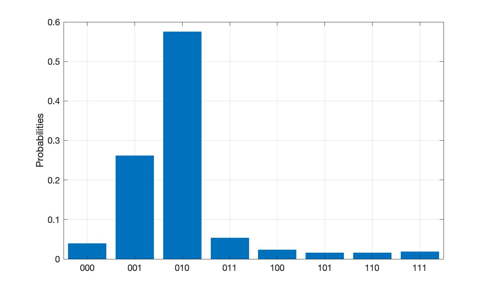

# 量子相位估计（QPE）

量子相位估计在很多量子算法中都发挥着重要作用，而且是 Shor 算法的重要一环，需要解决的问题大致如下：
>给定一个酉矩阵 $U$ 和它的特征向量 $|u\rangle$，我们想要找到相应的特征值，$U|u\rangle = e^{2\pi i\varphi} |u\rangle$ ( 相位 $\varphi$ 未知 )。由于 $U$ 是一个酉矩阵， 我们可以保证 $0\leq\varphi<1\,.$

---

## 算法部分

为了阐明相位估计算法的运行原理，考虑一个例子。假设
$$
U = 
\begin{bmatrix}
1 &0 \\
0 & e^{2i\pi/5}
\end{bmatrix}\,,
$$
它其中一个特征向量是 $|u\rangle = |1\rangle$，因此我们想要估计的相位是 $\varphi = 1/5$，$U|1\rangle = e^{2\pi i\varphi} |1\rangle$。一般来说，QPE 可以分为四个部分：

- **预处理**
  
  QPE 需要两个量子存储器，第一个量子存储器被称为计数存储器，包含 $n$ 个量子比特且全部初始化为 $|0\rangle$。我们将会以 2 进制的形式估计未知的相位 $\varphi$。$n$ 的大小决定了最后获得结果的精度。第二个量子存储器含有 $m$ 个量子比特，需要被初始化为特征向量 $|u\rangle$。在我们的例子中 $m=1，n=3$。由于第一个计数量子存储器只有三个量子比特，精度不会太高。这两个量子存储器的初始态应该是
  $$
  |\psi_0\rangle = |0\rangle^{\otimes n} \otimes |u\rangle =|000\rangle \otimes |1\rangle\,.
  $$

  我们可以在模拟器内轻松初始化：

  ```python
  qubit_num = 4
  shots = 1000
  phase = 2 * np.pi / 5
  
  
  def main():
    """
    main
    """
    # Create environment
    env = QEnv()
    # Choose backend Baidu Local Quantum Simulator-Sim2
    env.backend(BackendName.LocalBaiduSim2)

    # Initialize qubits
    q = env.Q.createList(qubit_num)
  
    # Prepare eigenstate |1> = X|0> on the ancilla qubit
    X(q[3])
  ```
  
- **制造叠加态 $H$**
  
  接下来我们在第一个储存器的所有量子比特上施加阿达玛门。由于它们的初始值为 $|0\rangle$，因此制作出一个叠加态后，我们得到的是
  $$
  |\psi_1\rangle = (H|0\rangle)^{\otimes n} \otimes |u\rangle = \frac{1}{\sqrt{2^n}}(|0\rangle + |1\rangle)^{\otimes n} \otimes |u\rangle
  $$

  在我们的例子中，$n=3$ 并且 $|u\rangle = |1\rangle$。在模拟器上，你可以按如下的方法使用阿达玛门

  ```python
      # Superposition
      H(q[0])
      H(q[1])
      H(q[2])
  ```
  
- **量子黑箱 $\hat{O}$**
  
  QPE 中的量子黑箱是一些受控酉矩阵，计数储存器的第 $j$ 个量子比特是控制比特，而受控酉矩阵 $U^{2^j}$ 则是作用在第二个量子储存器整体。令 $j = 2$，由于第二个储存器始终保持在特征能量态 $|u\rangle$ 上，我们得到
  $$
  U^{4}|u\rangle =  U^{3}U|u\rangle = e^{2\pi i\varphi} U^{3}|u\rangle = e^{2\pi i(2^1\varphi)}U^{2}|u\rangle = \cdots = e^{2\pi i (2^2\varphi)} |u\rangle
  $$
  
  可以看出这里有明显的递归关系，
  $$
  U^{2^j}|u\rangle =  U^{2^j-1}U|u\rangle = U^{2^j-1}e^{2\pi i\varphi} |u\rangle = \cdots = e^{2 \pi i (2^j \varphi)} |u\rangle, \quad j\in [0, n-1]
  $$
  
  然后我们需要搞明白这些受控酉矩阵到底都做了些什么。考虑第一储存器中的一般量子态
  $$
  |\phi\rangle = \alpha|0\rangle + \beta|1\rangle
  $$
  施加受控 U 门在整个量子系统上，可以得到
  $$
  CU|\phi\rangle \otimes  |u\rangle = \alpha|0\rangle \otimes  |u\rangle + \beta \cdot U|1\rangle \otimes  |u\rangle = \alpha|0\rangle \otimes  |u\rangle + \beta \cdot e^{2 \pi i\varphi}|1\rangle \otimes  |u\rangle
  $$
  
  这个技巧通常被称为**相位反冲 (phase kickback)**。注意到它的作用就是，通过 U 在第二储存器的作用，给控制比特增加了一个未知的相对相位 $\varphi$。绝大多数情况下，我们的直觉是控制比特应该不受影响的这里就比较特殊。随后我们在量子态 $|\psi_1\rangle$ 上施加 $\hat{O}$ (Control-$U^{2^j}$)
  $$
  \hat{O} |\psi_1\rangle = \frac{1}{\sqrt{2^n}}(|0\rangle + e^{2\pi i (2^{n-1}\varphi)}|1\rangle) \otimes\cdots \otimes (|0\rangle + e^{2\pi i (2^{0}\varphi)}|1\rangle)  \otimes |u\rangle
  $$
  在我们 3 量子比特的例子中，
  $$
  |\psi_2\rangle = \hat{O} |\psi_1\rangle =\frac{1}{\sqrt{8}}(|0\rangle + e^{2\pi i (4\varphi)}|1\rangle) \otimes(|0\rangle + e^{2\pi i (2\varphi)}|1\rangle) \otimes (|0\rangle + e^{2\pi i (1\varphi)}|1\rangle)  \otimes |1\rangle
  $$
  目前为止，我们构造的量子电路是
  
  
  
  好像还是有些不清楚，这些 $U^{2^j}$ 到底是什么东西？其实就是重复施加 $2^j$ 次受控 U 门
  
  
  
  在我们的模拟器中，受控 U 门可以由一个三参数受控旋转门生成。其中广义旋转门的定义是：
  $$
  R(\theta, \phi, \varphi) =
  \begin{bmatrix}
  \cos(\frac{\theta}{2})              & -e^{i\varphi}\sin(\frac{\theta}{2})\\
  e^{i\phi}\sin(\frac{\theta}{2})  & e^{i(\phi+\varphi)} \cos(\frac{\theta}{2})
  \end{bmatrix}
  $$

  当这三个参数取一些特定值的时候，我们就可以得到想要的酉矩阵。这里可以令 $\varphi' = 2\pi/5$。
  $$
  R(0, 0, \varphi') =
  \begin{bmatrix}
  1  &0\\
  0  & e^{i\varphi'}
  \end{bmatrix}
  $$
  代码如下
  
  ```python
      # Control-U gates
      CU(0, 0, phase)(q[0], q[3])
  
      CU(0, 0, phase)(q[1], q[3])
      CU(0, 0, phase)(q[1], q[3])
  
      CU(0, 0, phase)(q[2], q[3])
      CU(0, 0, phase)(q[2], q[3])
      CU(0, 0, phase)(q[2], q[3])
      CU(0, 0, phase)(q[2], q[3])
  ```
  
- **量子傅里叶变换 (QFT)**
  
  我们已经很接近最终答案了。不过，这是在傅里叶基向量的意义下。我们需要回归到经典的计算基去做测量，然后就可以读出 3 比特的近似相位值 $\hat{\varphi}$。关于量子傅里叶变换的详细讲解会单独开一个文档。介绍 QFT 之前，我们需要引入记号 $\varphi = 0.\varphi_0\cdots \varphi_{n-1}$ 来代表**二进制分数** $\varphi = \varphi_0/2+\cdots + \varphi_{n-1}/2^n$，其中每一个 $\varphi_i \in \{0,1\}$。在我们的例子中，由于只选取了 $n=3$ 个量子比特来估计相位，最好的精度只到达到以下两者：
  $$
  \varphi_0 =0, \varphi_1 =0, \varphi_2 = 1
  \quad \Rightarrow \quad
  \hat{\varphi}_{-} = \frac{1}{2}\varphi_0 + \frac{1}{4}\varphi_1 + \frac{1}{8}\varphi_2
   = \frac{1}{8}
  $$
  还有
  $$
  \varphi_0 =0, \varphi_1 = 1,  \varphi_2 = 0
  \quad \Rightarrow \quad
  \hat{\varphi}_{+} = \frac{1}{2}\varphi_0 + \frac{1}{4}\varphi_1 + \frac{1}{8}\varphi_2
   = \frac{1}{4}
  $$
  我们期望测量后概率振幅集中在这个范围内。如果我们想增加精度，或者说减小这个范围，那增加第一储存器中的量子比特数量 $n$ 即可。回到之前得到的 $|\psi_2 \rangle$ 可以用引入的新记号表示为：
  $$
  |\psi_2\rangle  =\frac{1}{\sqrt{8}}(|0\rangle + e^{2\pi i (0.\varphi_2)}|1\rangle) \otimes(|0\rangle + e^{2\pi i (0.\varphi_1\varphi_2)}|1\rangle) \otimes (|0\rangle + e^{2\pi i (0.\varphi_0\varphi_1\varphi_2)}|1\rangle)  \otimes |1\rangle
  $$
  为什么能这么做呢？不妨考察，
  $$
  2^1 \varphi = 2^1* (0.\varphi_0\varphi_1\varphi_2)
  = 2*( \frac{1}{2}\varphi_0 + \frac{1}{4}\varphi_1 + \frac{1}{8}\varphi_2)
  = \varphi_0 + \frac{1}{2}\varphi_1 + \frac{1}{4}\varphi_2
  = 0.\varphi_1\varphi_2
  $$
  同样的，
  $$
  2^2 \varphi = 2^2* (0.\varphi_0\varphi_1\varphi_2)
  = 4*( \frac{1}{2}\varphi_0 + \frac{1}{4}\varphi_1 + \frac{1}{8}\varphi_2)
  = 2\varphi_0 + \varphi_1 + \frac{1}{2}\varphi_2
  = 0.\varphi_2
  $$
  推广可以得到
  $$
  2^j \varphi = 2^j* (0.\varphi_0\cdots\varphi_{n-1})
  = 2^j*( \frac{1}{2}\varphi_0 + \cdots + \frac{1}{2^n}\varphi_{n-1})
  = 2^{j-1}\varphi_0 + \cdots+ \frac{1}{2}\varphi_j + \cdots
  = 0.\varphi_j\cdots\varphi_{n-1}
  $$
  现在我们可以去理解量子傅里叶变换能做些什么了，它把一个计算基中的元素映射到傅里叶基向量
  $$
  QFT_n |\varphi_0, \cdots, \varphi_{n-1}\rangle
  = \frac{1}{\sqrt{2^n}} (|0\rangle + e^{2\pi i (0.\varphi_{n-1})}|1\rangle) \otimes \cdots \otimes (|0\rangle + e^{2\pi i (0.\varphi_0\cdots\varphi_{n-1})}|1\rangle)
  $$
  这就是我们之前看到的 $|\psi_2\rangle$ 的形式。既然我们需要回到计算基中去测量，不如在 $|\psi_2\rangle$ 施加 3 量子比特傅里叶逆变换。
  $$
  QFT^{-1}_3\otimes I |\psi_2 \rangle = |\varphi_0, \varphi_1, \varphi_2\rangle \otimes  |u\rangle
  $$
  这个变换的矩阵表示是
  $$
  QFT^{-1}_{3} = \frac{1}{\sqrt{8}}
  \begin{bmatrix}
  1 &1 &1 &1 &1 &1 &1 &1\\
  1 &\sqrt{-i} &-i &-\sqrt{i} &-1 &-\sqrt{-i} &i &\sqrt{i}\\
  1 &-i &-1 &i &1 &-i &-1 &i\\
  1 &-\sqrt{i} &i &\sqrt{-i} &-1 &i &-i &-\sqrt{-i}\\
  1 &-1 &1 &-1 &1 &-1 &1 &-1\\
  1 &-\sqrt{-i} &i &\sqrt{i} &-1 &\sqrt{-i} &-i &-\sqrt{i}\\
  1 &i &-1 &-i &1 &i &-1 &-i\\
  1 &\sqrt{i} &i &-\sqrt{-i} &-1 &-\sqrt{i} &-i &\sqrt{-i}
  \end{bmatrix}
  $$
  电路表示是
  
   
  
  注意到如下两者量子门的等价性，
  $$
  R(0, 0, -\pi/4) =
  \begin{bmatrix}
  1  &0\\
  0  & e^{-i\frac{\pi}{4}}
  \end{bmatrix} 
  =T^\dagger\,.
  $$
  还有
  $$
  R(0, 0, -\pi/2) = \begin{bmatrix}
  1  &0\\
  0  & e^{-i\frac{\pi}{2}}
  \end{bmatrix} =
  \begin{bmatrix}
  1  &0\\
  0  & -i
  \end{bmatrix}
  =S^\dagger\,.
  $$
  有了这些之后，傅里叶逆变换就可以按如下方法在模拟器中制得
  
    ```python
        # 3-qubit inverse QFT
        SWAP(q[0], q[2])
        H(q[0])
        CU(0, 0, -np.pi / 2)(q[0], q[1])
        H(q[1])
        CU(0, 0, -np.pi / 4)(q[0], q[2])
        CU(0, 0, -np.pi / 2)(q[1], q[2])
        H(q[2])
    ```
  
  - **测量**
    
    费尽千辛万苦，我们终于可以读取出精心获得的成果 $\hat{\varphi} = 0.\varphi_0\varphi_1\varphi_2$
     
     结合上面所有步骤，我们得到测量结果:
    
    
    
    我们可以看到概率最高的态是 $|\varphi_0, \varphi_1, \varphi_2\rangle = |010\rangle$，正好对应着相对相位的估计值
    $$
    \hat{\varphi}_{3-qubit} = 0.\varphi_0\varphi_1\varphi_2 = \frac{1}{2}\varphi_0 + \frac{1}{4}\varphi_1 + \frac{1}{8}\varphi_2 = 0.25
    $$
    
    最终答案有 $25\%$ 的误差。但这是三个量子比特的计数寄存器能得到的最好结果了。如果我们用一个四量子比特的储存器，那么精度会更高 (误差按照 $1/2^n$ 的规模减小)。

---

## 代码示范

下面是完整代码，你可以修改数值做一些不同的尝试

```python
import numpy as np

import sys
sys.path.append('../../..')  # "from QCompute import *" requires this
from QCompute import *

matchSdkVersion('Python 3.3.0')

qubit_num = 4
shots = 1000
phase = 2 * np.pi / 5


def main():
    """
    main
    """
    # Create environment
    env = QEnv()
    # Choose backend Baidu Local Quantum Simulator-Sim2
    env.backend(BackendName.LocalBaiduSim2)

    # Initialize qubits
    q = env.Q.createList(qubit_num)

    # Prepare eigenstate |1> = X|0> on the ancilla qubit
    X(q[3])

    # Superposition
    H(q[0])
    H(q[1])
    H(q[2])

    # Control-U gates
    CU(0, 0, phase)(q[0], q[3])

    CU(0, 0, phase)(q[1], q[3])
    CU(0, 0, phase)(q[1], q[3])

    CU(0, 0, phase)(q[2], q[3])
    CU(0, 0, phase)(q[2], q[3])
    CU(0, 0, phase)(q[2], q[3])
    CU(0, 0, phase)(q[2], q[3])

    # 3-qubit inverse QFT
    SWAP(q[0], q[2])
    H(q[0])
    CU(0, 0, -np.pi / 2)(q[0], q[1])
    H(q[1])
    CU(0, 0, -np.pi / 4)(q[0], q[2])
    CU(0, 0, -np.pi / 2)(q[1], q[2])
    H(q[2])

    # Measurement result
    MeasureZ(*env.Q.toListPair())
    taskResult = env.commit(shots, fetchMeasure=True)
    return taskResult['counts']


if __name__ == '__main__':
    main()

```

---

## 讨论

可以看到，相位估计算法就是为了寻找一个给定酉矩阵的特征值的。这就是它为什么有时候会被称为**特征值估计**。你可以试着更改相位的数值为 $\varphi = 2\pi/3$，然后重新跑一下程序。看看你自己能不能解释得到的结果？

---

## 参考文献

[Nielsen, Michael A. & Isaac L. Chuang (2001). Quantum computation and quantum information (Repr. ed.). Cambridge [u.a.]: Cambridge Univ. Press. ISBN 978-0521635035.]()
