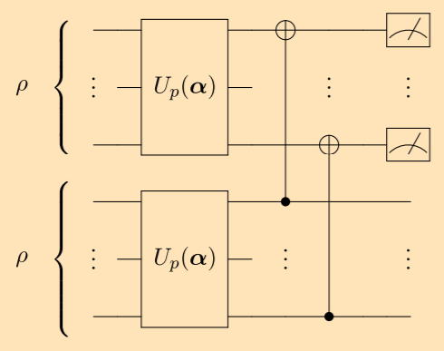
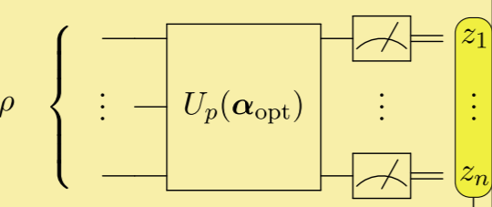

## 变分量子态对角化 (VQSD)

变分量子态对角化算法是量子-经典混合算法中的一员，可以看作是 VQE 算法的拓展。假设给定一个量子态，怎么找到它所有的特征值？按照量子力学的密度矩阵表示，每一个量子态都可以被表示为一个有非负特征值的埃尔米特矩阵，且这些特征值之和为 1。变分量子态对角化 (VQSD) 就是一个可以帮助我们找到量子态所有特征值的算法。VQSD 算法的核心思想很简单，首先建造一个参数化的电路 $U(\overrightarrow\theta)$，利用梯度下降算法进行参数优化。当参数优化到足够好时，输入初始态 $\rho$ 让这个电路运行，得到的输出态 $\rho' = U(\overrightarrow\theta)\rho U^\dagger(\overrightarrow\theta)$ 的非对角元元素就变成了（更准确地说是接近）$0$。

### 对角内积测量

对角内积测量是变分量子态对角化中的重要组成部分，它其实就是一个用来计算 $\text{Tr}(Z(\sigma)Z(\tau))$ 的电路，其中函数 $Z$ 的作用是将一个矩阵的非对角元变为 0,
$$
Z(\begin{pmatrix}
\tau_{11} & \cdots & \tau_{1m}\\
\vdots & \ddots & \vdots\\
\tau_{m1} & \cdots & \tau_{mm}
\end{pmatrix}) = \begin{pmatrix}
\tau_{11} & \cdots & 0\\
\vdots & \ddots & \vdots\\
0 & \cdots & \tau_{mm}
\end{pmatrix}\,.
$$
对角内积测量的电路表示见下图。


*图片来自于 [[1]](https://www.nature.com/articles/s41534-019-0167-6)*

正如图片所示，准备好两个量子态 $\sigma$ 和 $\tau$，然后加入一些 CNOT​ 门，测量目标量子比特 (在这幅图里也就是上半边的量子比特)，记录下测量得到的信息。重复以上步骤多次，计算出测量得到 $00\cdots0$ 的概率，这个概率便是 $\text{Tr}(Z(\sigma)Z(\tau))$ 的近似值。重复测量的次数越多，这个近似值就越精确。

### 参数化电路

接下来的一步是需要找到合适的参数使得 $\rho' = U(\overrightarrow\theta)\rho U^\dagger(\overrightarrow\theta)$ 成为一个（接近）对角化的量子态。



*图片来自于[[1]](https://www.nature.com/articles/s41534-019-0167-6)*

上述的图片展示了我们应该怎么做。准备好两个一样的量子态 $\rho$， 作为初始态分别输入到两个一摸一样的参数化电路中。这两个参数化电路有一样的参数。将输出的两个量子态作用对角内积测量，计算得到 $00\cdots0$ 的频率，这个频率便是 $Tr(Z(\rho')Z(\rho'))$ 的近似值。 这个数值越大，$\rho'$ 就越接近对角矩阵。如果你想知道背后的原因，可以去参考 [[1]](https://www.nature.com/articles/s41534-019-0167-6)。这就意味着我们要找到最优的参数 $\overrightarrow\theta_\text{optimal}$ 使得 $-Tr(Z(\rho')Z(\rho'))$ 最小化。注意到 $-Tr(Z(\rho')Z(\rho'))$ 本身就是关于 $\overrightarrow\theta$ 一个多元函数，也就是说，我们可以利用梯度下降帮我们寻找答案。

### 特征值的读出
经过一些列梯度下降优化，我们找到了 $\overrightarrow\theta_\text{optimal}$， 将 $\rho$ 作为输入态，运行量子电路 $U(\overrightarrow\theta_\text{optimal})$， 终于得到了一个（近似）对角态 $\rho'$。我们需要做什么才能从 $\rho'$ 那里得到它的对角元（也就是特征值）？当然是做很多次测量。



*图片来自于 [[1]](https://www.nature.com/articles/s41534-019-0167-6)*

量子态在测量后会发生坍塌，所以我们需要准备很多份 $\rho'$，测量这些量子态并统计出结果。计算所得到结果的频率，而这些统计出来的频率，就是我们梦寐以求的特征值。很显然，经历过如此长的步骤，我怕你是早就忘了文章的前半部分，不过不要紧，接下来的代码实战会让你重新复习一遍。

### Quantum Leaf 上的演练

首先我们装载相关的包。我们的例子模拟的是一个 2-qubit 的纯量子态，这个纯量子态是由一个提前定义好的电路生成的

```python
import copy

import numpy as np

import sys
sys.path.append('../../..')  # "from QCompute import *" requires this
from QCompute import *

matchSdkVersion('Python 3.3.1')
```
设置好参数和超参数
```python
shots = 100000
n = 2  # n-qubit
delta = np.pi / 2  # calculate derivative
learning_rate = 0.5  # learning rate
N = 15  # number of parameters
para = np.random.rand(N) * 2 * np.pi  # initial parameters
```


```python
def state_prepare(q, i):
    """
    This function is used to prepare state
    """

    RX(0.1)(q[i])
    RZ(0.4)(q[i + 1])
    CX(q[i], q[i + 1])
    RY(0.8)(q[i])
    RZ(1.2)(q[i])


def universal_cir(q, i, para):
    """
    This function builds a 15-parameterized circuit, which is
    enough to simulate any 2-qubit Unitaries
    """

    RZ(para[0])(q[i])
    RY(para[1])(q[i])
    RZ(para[2])(q[i])

    RZ(para[3])(q[i + 1])
    RY(para[4])(q[i + 1])
    RZ(para[5])(q[i + 1])

    CX(q[i + 1], q[i])

    RZ(para[6])(q[i])
    RY(para[7])(q[i + 1])

    CX(q[i], q[i + 1])

    RY(para[8])(q[i + 1])

    CX(q[i + 1], q[i])

    RZ(para[9])(q[i])
    RY(para[10])(q[i])
    RZ(para[11])(q[i])

    RZ(para[12])(q[i + 1])
    RY(para[13])(q[i + 1])
    RZ(para[14])(q[i + 1])


def my_cir(para):
    """
    This function returns the measurement result
    """

    env = QEnv()
    env.backend(BackendName.LocalBaiduSim2)
    q = env.Q.createList(2 * n)

    # Prepare a state
    for i in range(2):
        state_prepare(q, 2 * i)

    # Add parameterized circuit
    for i in range(2):
        universal_cir(q, 2 * i, para)

    # DIP test
    for i in range(2):
        CX(q[i], q[i + n])

    MeasureZ(*env.Q.toListPair())
    taskResult = env.commit(shots, fetchMeasure=True)

    return taskResult['counts']
```

```python
def data_processing(data_dic):
    """
    This function returns the frequency of getting 00xx
    """

    sum_0 = 0
    for key, value in data_dic.items():
        if int(list(key)[0]) + int(list(key)[1]) == 0:
            sum_0 += value
    return sum_0 / shots


def loss_fun(para):
    """
    This is the loss function
    """

    return -data_processing(my_cir(para))


def diff_fun(f, para):
    """
    It returns a updated parameter set, para is a np.array
    """

    para_length = len(para)
    gradient = np.zeros(para_length)

    for i in range(para_length):
        para_copy_plus = copy.copy(para)
        para_copy_minus = copy.copy(para)
        para_copy_plus[i] += delta
        para_copy_minus[i] -= delta

        gradient[i] = (f(para_copy_plus) - f(para_copy_minus)) / 2

    new_para = copy.copy(para)
    res = new_para - learning_rate * gradient
    return res
```
```python
def main():
    """
    Now we perform eigenvalues readout
    """

    para_list = [para]
    loss_list = []

    for i in range(30):
        para_list.append(diff_fun(loss_fun, para_list[i]))
        loss_list.append(loss_fun(para_list[i]))

    env = QEnv()
    env.backend(BackendName.LocalBaiduSim2)

    q = env.Q.createList(2 * n)

    state_prepare(q, 0)
    universal_cir(q, 0, para_list[-1])

    MeasureZ(*env.Q.toListPair())
    taskResult = env.commit(shots, fetchMeasure=True)
    print(taskResult['counts'])


if __name__ == '__main__':
    main()
```

其中一次运行的结果是

```python
{'00': 99563, '01': 405, '10': 27, '11': 5}
```

如果变成频率就是 $0.995, 0.004, 0.0027, 0.0005$, 和理论上的特征值 $1,0,0,0$ 很接近！
