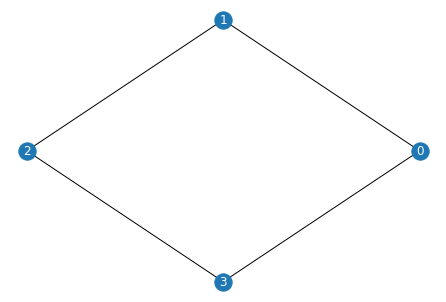
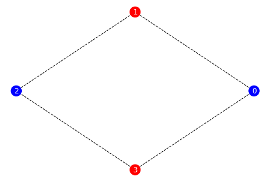

# Max-Cut Problem

<em> Copyright (c) 2021 Institute for Quantum Computing, Baidu Inc. All Rights Reserved. </em>

> If you run this tutorial with cloud computing power, you will consume about 300 Quantum-hub points.

## Overview

The Max-Cut problem is a common combinatorial optimization problem in graph theory, and it has important applications in statistical physics and circuit design. The maximum cut problem is an NP-hard problem, so there is no efficient algorithm that can solve this problem perfectly.

In graph theory, a graph is represented by a pair of sets $G=(V, E)$, where the elements in the set $V$ are the vertices of the graph, and each element in the set $E$ is a pair of vertices, representing an edge connecting these two vertices. For example, the graph in the figure below is represented by $V=\{0,1,2,3\}$ and $E=\{(0,1),(1,2),(2,3),(3, 0)\}$.

```python
import networkx as nx

# num_vertices is the number of vertices in the graph G, which is also the number of qubits
num_vertices = 4
G = nx.Graph()
V = range(num_vertices)
G.add_nodes_from(V)
E = [(0, 1), (1, 2), (2, 3), (3, 0)]
E.sort()
G.add_edges_from(E)
```



A cut on a graph refers to a partition of the graph's vertex set $V$ into two disjoint sets. Each cut corresponds to a set of edges, in which the two vertices of each edge are divided into different sets. So we can define the size of this cut as the size of this set of edges, that is, the number of edges being cut. The Max-Cut Problem is to find a cut that maximizes the number of edges being cut. Figure below shows a maximum cut of the graph in the figure above. The size of the maximum cut is $4$, which means that all edges in the graph are cut.


Assuming that the input graph $G=(V, E)$ has $n=|V|$ vertices and $m=|E|$ edges, we can describe the Max-Cut problem as a combinatorial optimization problem with $n$ bits and $m$ clauses. Each bit corresponds to a vertex $v$ in the graph $G$, and its value $z_v$ is $0$ or $1$, corresponding to the vertex belonging to the set $S_{0}$ or $S_{1}$, respectively. Thus, each value $z$ of these $n$ bits corresponds to a distinct cut. Each clause corresponds to an edge $(u,v)$ in the graph $G$. A clause requires that the two vertices connected by its corresponding edge take different values, namely $z_u\neq z_v$, which means the edge is cut. In other words, when the two vertices connected by the edge are divided into different sets, we say that the clause is satisfied. Therefore, for each edge $(u,v)$ in the graph $G$, we have

$$
C_{(u,v)}(z) = z_u+z_v-2z_uz_v,
\tag{1}
$$

where $C_{(u,v)}(z) = 1$ if and only if the edge is cut. Otherwise, the function is equal to $0$. The objective function of the entire combinatorial optimization problem is

$$
C(z) = \sum_{(u,v)\in E}C_{(u,v)}(z) = \sum_{(u,v)\in E}z_u+z_v-2z_uz_v.
\tag{2}
$$

Therefore, to solve the maximum cut problem is to find a value $z$ that maximizes the objective function in equation (2).


## Encoding Max-Cut Problem

In order to transform the Max-Cut problem into a quantum problem, we need to use $n$ qubits, where each qubit corresponds to a vertex in the graph $G$. A qubit being in a quantum state $|0\rangle$ or $|1\rangle$ indicates that its corresponding vertex belongs to the set $S_{0}$ or $S_{1}$, respectively. It is worth noting that $|0\rangle$ and $|1\rangle$ are the two eigenstates of the Pauli $Z$ gate, and their eigenvalues are respectively $1$ and $-1$, namely

$$
\begin{align}
Z|0\rangle&=|0\rangle,\tag{3}\\
Z|1\rangle&=-|1\rangle.\tag{4}
\end{align}
$$

Therefore, we can use Pauli $Z$ gates to construct the Hamiltonian $H_C$ of the Max-Cut Problem. Because mapping $f(x):x\to(x+1)/2$ maps $-1$ to $0$ and $1$ to $1$, we can replace $z$ in equation (2) with $(Z+I)/2$ ($I$ is the identity matrix) to get the Hamiltonian corresponding to the objective function of the original problem:

$$
\begin{align}
H_C &= \sum_{(u,v)\in E} \frac{Z_u+I}{2} + \frac{Z_v+I}{2}-2\cdot\frac{Z_u+I}{2} \frac{Z_v+I}{2}\tag{5}\\
&= \sum_{(u,v)\in E} \frac{Z_u+Z_v+2I-(Z_uZ_v+Z_u+Z_v+I)}{2}\tag{6}\\
&= \sum_{(u,v)\in E} \frac{I-Z_uZ_v}{2}.\tag{7}
\end{align}
$$

The expected value of this Hamiltonian for a quantum state $|\psi\rangle$ is

$$
\begin{align}
\langle\psi|H_C|\psi\rangle &= \langle\psi|\sum_{(u,v)\in E} \frac{I-Z_uZ_v}{2}|\psi\rangle\tag{8} \\
&= \langle\psi|\sum_{(u,v)\in E} \frac{I}{2}|\psi\rangle-\langle\psi|\sum_{(u,v)\in E} \frac{Z_uZ_v}{2}|\psi\rangle\tag{9}\\
&= \frac{|E|}{2}-\frac{1}{2}\langle\psi|\sum_{(u,v)\in E} Z_uZ_v|\psi\rangle.\tag{10}
\end{align}
$$

If we define

$$
H_D = -\sum_{(u,v)\in E} Z_uZ_v,
\tag{11}
$$

then finding the quantum state $|\psi\rangle$ that maximizes $\langle\psi|H_C|\psi\rangle$ is equivalent to finding the quantum state $|\psi\rangle$ such that $\langle\psi|H_D|\psi \rangle$ is the largest.

## QAPP and QCompute Implementation

Here are all packages and functions needed from the QAPP and QCompute.

```python
# Import related modules from QAPP and QCompute
from qapp.circuit import ParameterizedCircuit
from qapp.circuit import QAOAAnsatz
from qapp.optimizer import SPSA, Powell
from QCompute.QPlatform import BackendName
from qapp.algorithm import QAOA
from qapp.application.optimization.max_cut import MaxCut

# Import additional packages needed
import numpy as np
```

Following the method above, readers can use the code below to conduct the transformation.

```python
# Construct the Hamiltonian
max_cut = MaxCut(num_qubits = num_vertices)
max_cut.graph_to_hamiltonian(G)
print(max_cut._hamiltonian)
```
```
[[-1.0, 'zzii'], [-1.0, 'ziiz'], [-1.0, 'izzi'], [-1.0, 'iizz']]
```

We have transformed the Max-Cut problem into a quantum optimization problem via encoding. Now, we will show how to solve it with Quantum Approximate Optimization Algorithm [1] (QAOA). Interested readers can refer to [tutorials](https://qml.baidu.com/tutorials/combinatorial-optimization/quantum-approximate-optimization-algorithm.html) provided by Paddle Quantum. Here, we use ``QAOAAnsatz`` provided in QAPP to build the quantum circuit. We first define parameters used in the parameterized circuit, i.e. QAOA circuit.

```python
layer = 2 # Number of layers in the quantum circuit
parameters = 2 * np.pi * np.random.rand(layer * 2)
iteration_num = 100

ansatz = QAOAAnsatz(num_vertices, parameters, max_cut._hamiltonian, layer)
```

We then define the optimizer used to optimize the parameters to achieve the maximum eigenvalue of the encoded Hamiltonian. Here we use ``SPSA`` provided by QAPP. Readers can also use other optimizers, like ``Powell`` .

```python
# Use SPSA optimizer
opt = SPSA(iteration_num, ansatz, a=0.5, c=0.15)
```

We now can run ``QAOA`` algorithm to start solving the Max-Cut problem. We set the default backend as ``LocalBaiduSim2``. Readers can find more backend choices from [Quantum-hub](https://quantum-hub.baidu.com/). Specifically, readers can use ``BackendName.CloudIoPCAS`` to get access to real quantum devices.

```python
backend = BackendName.LocalBaiduSim2
# Readers should get their tokens from quantum-hub.baidu.com to be connected to real quantum devices and cloud backend.
# from QCompute import Define
# Define.hubToken = 'your token'
# backend = BackendName.CloudIoPCAS # Real quantum computer
# backend = BackendName.CloudBaiduSim2Water # Cloud backend
measure = 'SimMeasure' # Define pauli measurement method
qaoa = QAOA(num_vertices, max_cut._hamiltonian, ansatz, opt, backend, measure)
qaoa.run(shots=4096)
print("The maximum eigenvalue: ", qaoa.maximum_eigenvalue)
```
```
terminated after reaching max number of iterations
The maximum eigenvalue:  3.99951171875
```

### Decoding the quantum solution
After obtaining the minimum value of the loss function, our task has not been completed. In order to obtain an approximate solution to the Max-Cut problem, it is necessary to decode the solution to the classical optimization problem from the quantum state output by QAOA. Physically, to decode a quantum state, we need to measure it and then calculate the probability distribution of the measurement results.

Usually, the greater the probability of a certain bit string, the greater the probability that it corresponds to an optimal solution of the Max-Cut problem. To get the state with the highest probability, we use the following code:

```python
# Repeat the measurement of the circuit output state 2048 times
counts = qaoa.get_measure(shots=2048)
# Find the most frequent bit string in the measurement results
cut_bitstring = max(counts, key=counts.get)
solution = max_cut.decode_bitstring(cut_bitstring)
print("The Max-Cut solution of this graph found is: ", solution)
```
```
The Max-Cut solution of this graph found is: {0: '1', 1: '0', 2: '1', 3: '0'}
```

The bit string above is the optimal solution found by QAOA. Let the vertices whose bit values are $0$ in the bit string belong to the set $S_0$ and the vertices whose bit values are $1$ belong to the set $S_1$. The set of edges between these two vertex sets is a possible maximum cut of the graph.

The following code selects the bit string with the greatest chance of appearing in the measurement result, then maps it back to the classic solution, and draws the corresponding maximum cut:
- The red vertex belongs to the set $S_0$,
- The blue vertex belongs to the set $S_1$,
- The dashed line indicates the edge being cut.



_______

## References

[1] Farhi, Edward, Jeffrey Goldstone, and Sam Gutmann. "A quantum approximate optimization algorithm." arXiv preprint [arXiv:1411.4028 (2014)](https://arxiv.org/abs/1411.4028).
